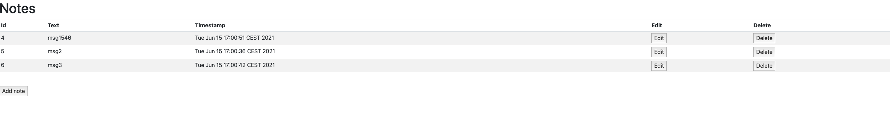

# M8_hibernate_HOMEWORK
## Zad1 Napisz aplikacje, 
- [x] która łączy się z API pogodowym 
- [x] i co godzinę zapisuje informacje na temat aktualnej temperatury w bazie danych (wykorzystaj Hibernate).

## Zad2. Napisz Notatnik online – aplikacje z interfejsem graficznym, 
- [x] która umożliwia na tworzenie notatek, 
- [x] zapisywanie ich w bazie danych, 
- [x] późniejszą edycję, 
- [x] oraz wyświetlanie.
  